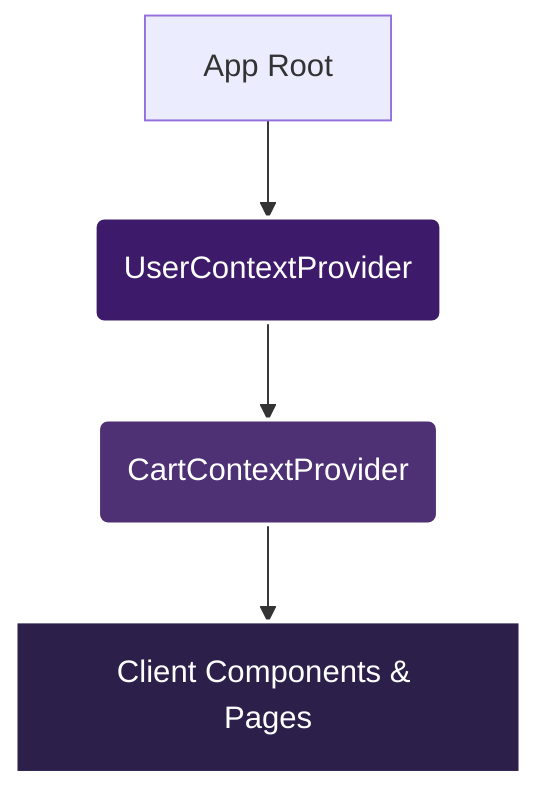
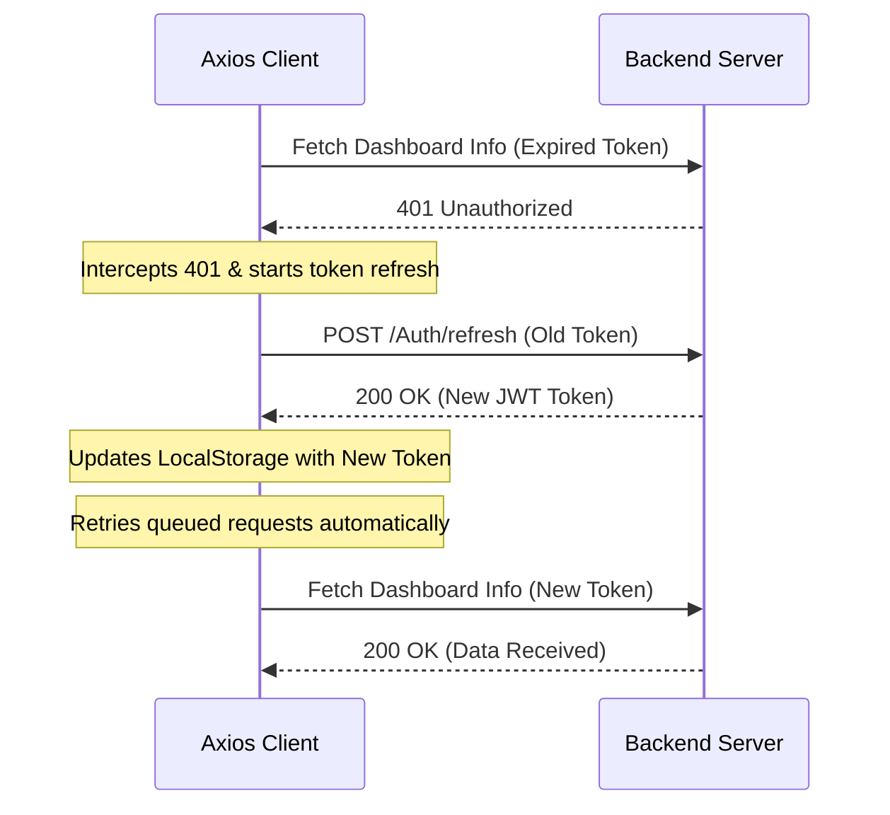

# Deeb AI (Namaa) — Frontend Documentation

Welcome to the frontend documentation for the **Deeb AI (Namaa)** graduation project. This repository contains the complete admin dashboard and client-side applications built using React and modern frontend tools.

---

## 1. Project Overview

**Deeb AI (Namaa)** is an AI-powered business analytics and insights platform designed specifically for Small and Medium Businesses (SMBs). The system helps business owners turn operational and transactional data into actionable insights, enabling them to make smarter data-driven decisions.

### Target Users
1. **Client-Side (User-Facing) Application**:
   - **Target Audience**: SMB Owners, Managers, and Business Operators.
   - **Core Use Cases**: Browse platform features, view pricing packages, set up configurations, manage active subscriptions, configure payment methods, sync data sources, and monitor custom analytics dashboards.
2. **Admin Dashboard**:
   - **Target Audience**: Platform Administrators, Superusers, and Support Agents.
   - **Core Use Cases**: Manage clients and administrative users, configure fine-grained role permissions, track platform packages/services (CRUD operations), monitor client orders, track overall subscriptions, view analytical charts, and execute user status toggles.

### Tech Stack
The frontend is built on **React** as a component-based, highly scalable architecture utilizing **Vite** for optimized building, fast hot-reloading (HMR), and efficient bundle sizes.

---

## 2. Tech Stack & Dependencies

The project leverages a robust stack of modern npm packages to ensure stability, responsiveness, and clean interactive features:

| Package / Library | Version | Purpose |
| :--- | :--- | :--- |
| **React** | `^19.1.1` | Core UI library for component-based rendering |
| **React DOM** | `^19.1.1` | DOM rendering and layout updates |
| **React Router DOM** | `^7.9.3` | Client-side routing, navigation, and protected routes |
| **Axios** | `^1.12.2` | HTTP client for backend API communication and interceptor handling |
| **Formik** | `^2.4.6` | Form state management and submission control |
| **Yup** | `^1.7.1` | Schema-based form validation |
| **Bootstrap** | `^5.3.8` | Responsive design grid framework and utility classes |
| **React Bootstrap** | `^2.10.10` | Bootstrap components built natively for React layouts |
| **SweetAlert2** | `^11.26.x` | Interactive, stylized confirmation alerts and dialog modals |
| **React Hot Toast** | `^2.6.0` | Non-blocking, light toast alerts |
| **ECharts** & **ECharts for React** | `^5.6.0` / `^3.0.2` | High-performance interactive analytical widgets and charts |
| **Recharts** | `^3.5.1` | Declarative responsive chart components (Admin dashboard) |
| **PapaParse** | `^5.5.3` | CSV parser for data integrations and exports |
| **React Spinners** | `^0.17.0` | Stylized loading spinners for async actions |
| **Lucide React** | `^0.563.0` | Modern, clean svg iconography |
| **FontAwesome Free** | `^7.1.0` | System icon set |

---

## 3. Project Structure (Folder Structure)

Both the **Client-Side** and **Admin Dashboard** applications share an aligned directory architecture, allowing developers to context-switch between projects easily.

### The `src/` Directory Organization
```text
src/
├── assets/                  # Static assets: images, local fonts, branding logos
│   ├── fonts/               # Inter typography font files
│   └── images/              # Layout placeholders and background graphics
├── Components/              # Modular UI components grouped by feature
│   ├── Subscriptions/       # Component folder containing logic and styles
│   │   ├── Subscriptions.jsx
│   │   └── Subscriptions.module.css
│   ├── Protected/           # Route guards implementation
│   │   ├── Protected.jsx
│   │   └── Protected.module.css
│   └── Layout/              # Structure containers (NavBar, Footer, Sidebar layouts)
├── context/                 # Global React Context providers
│   ├── userContext.jsx      # Authentication and profile state
│   └── CartContext.jsx      # Cart items sync and persistence
├── utils/                   # Helper functions and global utilities
│   └── imageUrl.js          # Backend URL assets resolver
├── api.js                   # Axios base client, interceptors, and token refresh logic
├── App.jsx                  # Main routing declarations (createBrowserRouter)
├── App.css                  # Global overrides and helper style overrides
├── index.css                # Base stylesheet, design system tokens, typography
└── main.jsx                 # React root entry, mounts Context Providers and Router
```

### Naming Conventions
- **PascalCase**: Used for all component directories and file names (e.g., `Subscriptions/Subscriptions.jsx`).
- **PascalCase.module.css**: Used for component-isolated stylesheet modules (e.g., `Subscriptions.module.css`).
- **camelCase**: Used for JavaScript helper files, contexts, parameters, and functions (e.g., `imageUrl.js`, `api.js`, `userContext.jsx`).

---

## 4. Installation & Setup

### Prerequisites
- **Node.js**: Version `18.x` or `20.x` (LTS versions recommended).
- **Package Manager**: `npm` (v9+) or `yarn` (v1.x+).

### Step-by-Step Local Deployment
1. **Clone the repository** and navigate to your target frontend application directory:
   ```bash
   cd final-grad-app   # For Client-Side Application
   # OR
   cd Admin-grad-app   # For Admin Dashboard Application
   ```
2. **Install project dependencies**:
   ```bash
   npm install
   ```
3. **Set up Environment Variables**:
   Create a `.env` file in the root of the project (see [Environment Variables](#5-environment-variables) below).
4. **Launch the local development server**:
   ```bash
   npm run dev
   ```
   *The application will launch on your local host (usually `http://localhost:5173`).*

### Available Scripts
- `npm run dev`: Boots up Vite's local dev server with HMR.
- `npm run build`: Generates compressed, optimized build files inside the `/dist` output directory.
- `npm run lint`: Scans code files using ESLint for style validation and potential bugs.
- `npm run preview`: Launches a local server previewing the generated production files in `/dist`.

---

## 5. Environment Variables

Define a `.env` file in the root directory of your app with the following configuration:

```env
VITE_API_BASE_URL=/api
```

- **`VITE_API_BASE_URL`**: Instructs the HTTP client where to send network requests. Setting this to `/api` allows the local Vite proxy or cloud host (like Vercel or Netlify) to rewrite requests dynamically to the target backend service, avoiding Cross-Origin Resource Sharing (CORS) complications during development and production.

---

## 6. Routing (React Router)

Routing is powered by **React Router DOM v7** utilizing the modern data-driven router patterns (`createBrowserRouter` and `<RouterProvider>`).

### Client-Side Routes List
- **Public Routes**:
  - `/login`: User login gateway.
  - `/register`: User registration form.
  - `/check-email`: Email verification landing instructions.
  - `/confirm-email`: Verification confirmation page.
  - `/reset-password` / `/change-password`: Security password restoration paths.
  - `/google/callback`: Catch-all redirection logic for Google OAuth logins.
  - `/home`: Homepage landing, highlighting Deeb AI's value proposition.
  - `/demo`: Form allowing companies to request custom demos.
  - `/pricing`: Details about standard pricing plans and customization sliders.
  - `/features` / `/feature-details/:id`: Overview of platform capabilities.
  - `/privacy`: Platform privacy policies.
- **Protected Routes**:
  - `/profile`: Base layout for personal configuration.
    - `/profile/info`: Modify display profile credentials.
  - `/dashboard`: Core dashboard view.
    - `/dashboard/home`: Personalized client overview page.
    - `/dashboard/subscription`: View active packages, dates, and renewals.
    - `/dashboard/billing`: Download invoices and transaction statements.
    - `/dashboard/security`: Update profile passwords.
    - `/dashboard/data-sources`: Register/sync company data sources.

### Admin Dashboard Routes List
- **Public Routes**:
  - `/`: Admin login page.
  - `/forget-password`: Password reset initiation.
  - `/check-email` / `/reset-password` / `/activate-account`: Support security pipelines.
- **Protected Routes (`/dashboard/*` nested routes)**:
  - `/dashboard`: Home metrics, platform overview, active counters.
  - `/dashboard/clients`: Searchable lists of registered businesses with status toggles.
  - `/dashboard/customersview/:id`: Complete client business profile.
  - `/dashboard/roles` / `/dashboard/roles/:id`: Role assignments and edit permission mappings.
  - `/dashboard/my-permissions`: List currently logged-in administrator permissions.
  - `/dashboard/users` / `/dashboard/users/:id`: Internal system users CRUD.
  - `/dashboard/services` (with `/add`, `/:id`, `/:id/edit`): CRUD operations for services.
  - `/dashboard/packages` (with `/add`, `/:id`, `/:id/edit`): CRUD operations for packages.
  - `/dashboard/orders`: Grid of client platform invoices.
  - `/dashboard/subscriptions` / `/:id`: Client active service contracts.

### Route Guard Implementation
The protected routes are wrapped in a custom `<Protected>` component:
```jsx
// src/Components/Protected/Protected.jsx
export default function Protected(props) {
  let { userToken, loading } = useContext(userContext);

  if (loading) {
    return <div>Loading...</div>; // Spinner fallback while checking authentication status
  }

  if (userToken !== null) {
    return props.children; // Access allowed
  } else {
    return <Navigate to="/" />; // Redirect back to landing/login
  }
}
```

---

## 7. Authentication & Authorization

### The Authentication Flow
1. **Credentials Login**: Users insert email and password in the Formik form. Submission triggers a POST request to `/Auth`.
2. **Token Storage**: On success, the API returns a JWT token. The application stores the token in `localStorage` under `token` and updates `userToken` in `userContext`.
3. **Google OAuth Integration**: Clicking "Login with Google" redirects the browser to:
   `https://accounts.google.com/o/oauth2/v2/auth` with the project's Google Client ID. Upon user authorization, Google redirects the browser back to `/google/callback` with a temporary code. The frontend exchanges this code via `/Auth/google` to obtain a standard JWT token.
4. **Token Injection**: The Axios request interceptor intercepts all outgoing requests and appends the token to the header:
   `Authorization: Bearer <JWT_TOKEN>`

### Roles and Permissions (Authorization)
- **Client User**: Restricted access to client profile panels and billing logs.
- **Admin Roles**: Administrators can view and customize specific permission matrices inside the Admin Dashboard `/dashboard/roles/:id` panels. Backend validations inspect JWT claims, while the frontend dynamically hides or displays components based on the active administrator's permissions.

---

## 8. Client-Side Section: Pages, Layouts, and UI Flows

The Client-Side application provides a premium, responsive interface tailored for SMBs. The pages are designed with modern glassmorphism elements, dark gradient accents, and micro-interactions.

### 8.1 Home & Features Explorer (`/home`)
* **Visual Design**: Features a hero section with custom illustrations, a bold typography gradient (`Turn Your Business Data Into Actionable Insights`), and animated feature card grids.
* **Component Flow & Logic**:
  1. **Reviews Fetching**: On mount, a `useEffect` queries `/Reviews/landing-page` to retrieve customer testimonials. If there are more than 3 reviews, it mounts a fast, duplicate marquee tracker that scrolls infinitely using CSS animations.
  2. **Service Tabs Showcase**: Queries `/Services` to fetch available services. It displays these service names in a scroll-resistant horizontal tab layout. Clicking a tab updates the active index, swapping the visible service card info, icon (resolved via a dynamic local `iconMap` of Lucide icons or server-delivered URLs), subheadings, and mockup images.
  3. **Interactive CTA**: Directs users to `/demo` for automated trial setups or to `/features` for the deep feature index.

### 8.2 Pricing, Packages & Estimator (`/pricing`)
* **Visual Design**: Centered layout starting with a highlighted "Flexible Pricing" badge. Custom 3D carousel cards with rounded corners, bright purple highlights, and drop shadows are utilized to display different pricing tiers.
* **Component Flow & Logic**:
  1. **Bundle Carousel**: The carousel queries `/Packages` and lists all package bundles. It supports slide navigation (`goNext`, `goPrev`) updating a visible indices sub-array. The center card scales up (`carousel_card_active`), while the side cards scale down (`carousel_card_side`) to create a 3D effect.
  2. **Individual Services Selector**: Queries `/Services/cards` to list individual features. Users can pick specific features to build custom estimates.
  3. **Cart Syncing & Local Storage**: When a user clicks "Add to Estimate", the component checks if `userToken` exists. If logged in, it sends a POST request to `/Cart` to save it in the database. If the user is a guest, the selection is written into a local array in `localStorage` under `local cart`.
  4. **Checkout Route**: Clicking "Proceed to Checkout" makes a POST request to `/Orders/package` for bundles, which generates a Stripe checkout URL, and redirects the browser window directly to the checkout page.

### 8.3 Custom Estimation & Shopping Cart (`/cart`)
* **Visual Design**: A split two-column dashboard layout. The left column contains expandable service configuration cards, and the right column houses the billing receipt summary block.
* **Component Flow & Logic**:
  1. **Cart Syncing on Login**: A `useEffect` detects if a guest has logged in. If a `userToken` is present and items exist in the local guest cart, it sequentializes POST calls to `/Cart` to sync guest items with the backend database. Once synced, it clears the local guest storage.
  2. **Dynamic Plan Customizer**: For each service in the cart, the user can toggle custom commitment duration dropdowns (e.g., 30 days, 90 days, 180 days) and select token tiers.
  3. **Real-time Cost Calculations**: Changing these inputs triggers a recalculation of the totals. It computes the Base Price, Token Allocation Price, and any commitment discounts dynamically using `useMemo` so that updates are instantaneous without extra network calls.
  4. **Promo Codes**: Offers a Formik text field to apply discount codes. Submitting verifies the code via `/Orders/discount-codes/validate?code=PROMO` and deducts the discount percentage from the subtotal.
  5. **Payment Redirect**: Clicking checkout triggers a POST request to `/Orders/services` with the payload array of `serviceId`, `servicePriceId`, and `serviceTokensId`, then transfers the client to the payment gateway.

---

## 9. Admin Dashboard Section: Pages, Layouts, and UI Flows

The Admin Dashboard features a deep purple dark-themed design language focusing on readability, tabular sorting, status control overlays, and analytical widgets.

### 9.1 Clients Listing & Status Controller (`/dashboard/clients`)
* **Visual Design**: The page opens with six KPI cards (Total Customers, Active Accounts, Disabled Accounts, Locked Accounts, Active Subscribers, and New This Month). The main area displays a data table with profile avatars and custom status badges.
* **Component Flow & Logic**:
  1. **Search & Checkbox Dropdown**: Admins can type search queries. Clicking "Search In" opens a floating relative dropdown menu to select target database properties (Email, BusinessName, Position, UserName).
  2. **Sorting & Filtering**: Each header column contains interactive triangle buttons (▲/▼) that update state variables `sortColumn` and `sortDirection`. Changing these automatically triggers a fresh POST request to `/Clients/search`.
  3. **Status Toggle Switch**: Every row features a custom iOS-style slider switch. Toggling the switch opens a SweetAlert2 confirmation dialog. If confirmed, a PUT request to `/Clients/:id/toggle-status` changes the user access status on the server.
  4. **Account Unlock**: If an account is locked due to multiple failed login attempts, the badge turns red and displays a lock icon. Clicking the badge opens a dialog to trigger an unlock request via `/Clients/:id/unlock`.

### 9.2 Client Detailed Inspector (`/dashboard/customersview/:id`)
* **Visual Design**: Displays breadcrumb navigation, breadcrumb links, a large profile banner, detailed info grids, and a database credentials table.
* **Component Flow & Logic**:
  1. **Initial Profile Queries**: Fetches profile data from `/Clients/:id`, active user subscriptions from `/Clients/:id/subscriptions`, and database configs from `/Clients/:id/database-connections` on mount.
  2. **Tableau Integration**: If a Tableau URL exists, it renders an embedded iframe or external link. If empty, a Formik form modal validates input via Yup and submits a PUT request to `/ClientSubscriptions/:customerId/tableau-url` to update the customer's dashboard.
  3. **Database Connections Grid**: Lists all database connections established by the customer. Admins can view DB types, host names, connection statuses, and click "Manage" to configure credentials.

### 9.3 Subscriptions Monitor (`/dashboard/subscriptions`)
* **Visual Design**: Tabular layout listing active subscriptions, plan types (Standard vs Customized), auto-renewal states, and start/end dates.
* **Component Flow & Logic**:
  1. **API Parameter Construction**: Sends a GET request to `/admin/client-subscriptions` using `URLSearchParams` to pass pagination, search keys, plans filters, and sorting parameters.
  2. **30-Day Expiry Warnings**: Evaluates active subscription end dates. If the end date falls within 30 days of the current date, the row highlights a warning color to prompt admin renewals.

### 9.4 Orders & Revenue Tracker (`/dashboard/orders`)
* **Visual Design**: Features 5 metrics tiles (Total Orders, Awaiting Payment, Refunded, Total Revenue, Today Revenue) followed by a data list.
* **Component Flow & Logic**:
  1. **Flexible Filter Controls**: Admins can filter by order types (Package, Service, AddOn), status (Pending, Paid, Cancelled, Refunded), date range pickers, and price range sliders.
  2. **Real-time Validations**: Form controls block fetching queries if the input parameters are illogical (e.g., maximum price is less than minimum price or end date is earlier than start date).
  3. **Interactive Sorting**: Features sorting by "TotalPrice" and "OrderDate" directly on the table headers.

---

## 10. Component Architecture

The codebase leverages clean composition patterns to minimize repetition and improve maintainability:

### Reusable UI Components
- **Tables & Pagination Footers**: Components utilizing custom CSS modules with integrated sorting arrow buttons, chevron page controllers, and indicators.
- **Input Controllers**: Custom form inputs containing integrated icons, dynamic validation labels, and password eye togglers.
- **Custom Overlays**: CSS module-isolated backdrops paired with `react-spinners` for background operations.
- **Interactive Badges**: Aligned colors mapping active, cancelled, expired, or terminated categories.

### Custom Context Hooks
- **`useContext(userContext)`**: Exposes authentication details, active status verification, profile image URLs (appended with timestamp queries `?t=` to bypass local cache on updates), and login/logout methods.
- **`useContext(CartContext)`**: Exposes active shopping arrays, checkout helpers, and database synchronization actions.

---

## 11. State Management

The global state system is kept lightweight and performant:



### Global State (Context API)
- **Auth Credentials (`userContext`)**: Token values, loading checks, user emails, and profile avatars.
- **Cart Contents (`CartContext`)**: Array of services in checkout, remote fetching, and client sync methods.

### Local State (`useState` / `useEffect`)
- Grid filters, search queries, active pagination counts, sorting properties, temporary passwords, UI menu flags, and local form status.

---

## 12. API Integration

API communications are routed through a dedicated Axios configuration file `/src/api.js`.

### Interceptors & Request Pipeline
- **Automatic Headers**: Sets `Authorization: Bearer <token>` automatically if a token exists in storage.
- **Network Proxying**: Utilizes absolute paths proxied locally or hosted rewrites on Vercel to route traffic to `https://deebai.runasp.net`.

### Silent Token Refresh Flow
If a request encounters a `401 Unauthorized` response (and is not an authentication endpoint), the refresh mechanism kicks in:


1. **Queueing**: Sets a local flag `isRefreshing = true` and pushes all incoming failing requests into a queue (`failedQueue`).
2. **Refresh POST**: Calls `/Auth/refresh`, passing the old token.
3. **Success**: Stores the new token, updates Axios default headers, resolves all queued promises, and replays original requests.
4. **Failure**: If token refresh fails (400, 401, 403 response), the system executes a logout: clears storage and redirects to `/login`.

---

## 13. UI/UX Design System

The platform features a premium, modern design language:

### Color Palette
Deeb AI (Namaa) incorporates a modern, dark-themed violet and blue color spectrum defined via `oklch` coordinates in the admin project's design system:
- **Primary / Sidebar Background**: `oklch(0.2 0.08 250)` (Deep Blue-Purple)
- **Secondary / Hover State**: `oklch(30.256% 0.068 249.977)` (Royal Violet)
- **Background Main**: `oklch(0.98 0.005 250)` (Ultra Light Slate Gray)
- **Accent Highlight**: `oklch(0.45 0.1 250)` (Bright Slate Blue)
- **Destructive State**: `oklch(0.577 0.245 27.325)` (Crimson Red)

### Typography
- **Font Face**: **Inter** variable font family loaded locally via `src/assets/fonts/Inter-VariableFont_opsz,wght.ttf` and imported in global stylesheets.
- **Monospace Font**: `DM Mono` for special data keys and system identifiers.

### Responsive Design
The system uses a **mobile-first grid architecture** built on Bootstrap containers.
- Custom media queries wrap search bar filter items, center button groupings on overflow, and collapse navigation sidebars on smaller screens to prevent content clipping.

---

## 14. Error Handling & Edge Cases

- **Validation Errors**: Validation rules are enforced using Yup. Input components display real-time warning labels in case of invalid entries.
- **Route Fallbacks (404)**: Unmatched paths are caught by `<Route path="*" element={<NotFound />} />` which displays an illustrated 404 message guiding users back to safety.
- **Empty States**: Data tables render clear, friendly notification rows (e.g., "0 subscriptions found" or "No records match search parameters") when lists return empty from the API.
- **SweetAlert2 Alerts**: Failures are intercepted globally to display stylized alert popups with rich color gradients.

---

## 15. Performance Optimization

- **Vite Bundling**: Production files are generated with index hashes, preventing caching issues during deployment cycles.
- **Cache-Busting Image Links**: Profile images append dynamic timestamps (`?t=timestamp`) during update cycles, allowing browsers to reload local avatars without requiring page restarts.
- **Lazy Cart Fetching**: Cart updates are limited to essential lifecycle hooks, and local cart syncing minimizes backend traffic.

---

## 16. Browser & Device Support

### Tested Breakpoints
- **Mobile Viewports** (up to `768px`): Fluid collapsing navigation menus, full-screen form steps, centered dialog popups.
- **Tablet Layouts** (`768px` to `1024px`): Adaptive grids, scrolling list wrappers, grid columns.
- **Desktop Screens** (`1024px` and above): Expanded sidebars, large analytics charts, complete tabular lists.

### Browser Compatibility
Tested and optimized for performance across all modern engines:
- Google Chrome
- Apple Safari
- Mozilla Firefox
- Microsoft Edge

---

## 17. Deployment (Vercel)

Both frontend applications are configured for deployment on the **Vercel** platform.

### Rewrite Configurations (`vercel.json`)
To bypass CORS blocks during browser communications and support React Router Single Page Application (SPA) routing, both roots feature `vercel.json` rewrite settings:

```json
{
  "rewrites": [
    {
      "source": "/api/:path*",
      "destination": "https://deebai.runasp.net/api/:path*"
    },
    {
      "source": "/(.*)",
      "destination": "/index.html"
    }
  ]
}
```

- **API Redirection**: Intercepts all client calls targeting `/api/*` and proxies them to the backend API (`https://deebai.runasp.net/api/*`).
- **SPA Rewrite**: Directs all non-file asset URLs to `/index.html`, allowing React Router to parse path parameters correctly.

### Deployment Process
1. Connect the GitHub repository to the Vercel Dashboard.
2. Select your framework preset: **Vite**.
3. Confirm Build Settings:
   - **Build Command**: `npm run build`
   - **Output Directory**: `dist`
4. Set Environment Variables on Vercel:
   - Add `VITE_API_BASE_URL` with value `/api`.
5. Click **Deploy**.

---

## 18. Known Issues / Limitations

- **Local Storage Reliance**: The JWT is stored in `localStorage`, which is susceptible to cross-site scripting (XSS) in insecure environments.
- **Network Dependency**: Analytics graphs require active connections to render analytical components correctly.

---

## 19. Future Improvements

- **Secure HTTP-Only Cookies**: Update authentication architecture to use secure HTTP-only cookies for token transmission, enhancing platform protection.
- **Global State Scalability**: Introduce **Zustand** or **Redux Toolkit** if client dashboard modules scale beyond auth/cart requirements.
- **WebSockets Integrations**: Implement live server-sent event feeds for real-time order alerts and live analytics tracking inside the Admin Dashboard.
