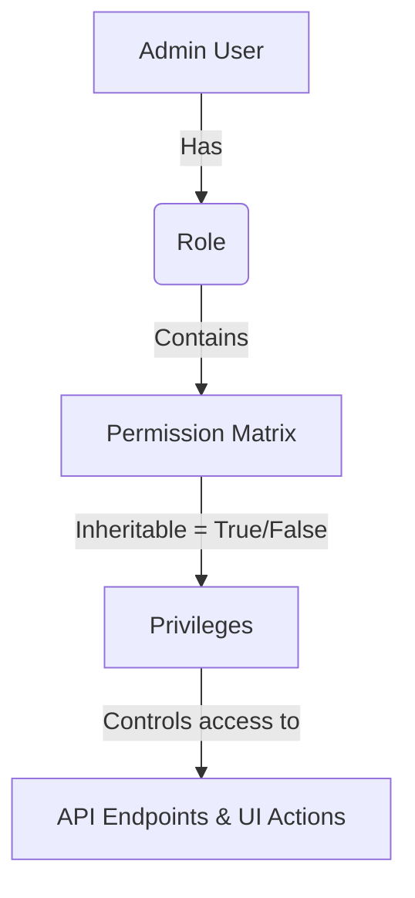

# Admin Dashboard — Technical Architecture & Reference Manual

Welcome to the professional technical documentation for the **Namaa (Deeb AI) Admin Dashboard**. This reference manual is designed for Platform Administrators, Superusers, and Support Agents to understand, maintain, and develop the administrative control plane of the Namaa platform. 

This repository houses the React 19 application that governs system-wide configurations, handles role-based access control, tracks client subscriptions, verifies database connection health, inspects financial transactions, and facilitates service and pricing package management.

> [!NOTE]
> *For shared fundamentals such as Vite build configuration, Axios silent refresh interceptors, global authentication context, and core OKLCH design variables, please refer to the **Client-Side Application Documentation**. This manual focuses strictly on admin-specific components, layouts, RBAC systems, page workflows, and admin-only backend API endpoints.*

---

## 1. System Users & Access Control Levels

The Admin Dashboard provides access to three distinct user archetypes, each mapped to specific permissions and functional boundaries:

1. **Platform Administrators**: Superusers with unrestricted access to the dashboard. They can create/modify administrative user accounts, configure custom security roles, assign global permissions, update system packages, manage client databases, and oversee all platform parameters.
2. **Superusers**: Experienced administrators who focus on business-level updates. They manage active subscriptions, configure pricing and discount periods, approve package changes, and inspect platform analytics, while lacking permissions to modify roles or delete core configurations.
3. **Support Agents**: Customer service operators who utilize the dashboard to inspect client profiles, view invoice histories, search transactional logs, audit system events, and assist clients in troubleshooting their synced database connections.

---

## 2. Layout, Routing, & Security Architecture

### App Layout Scaffolding (`Layout.jsx`)
The main interface shell is managed by the unified [Layout](file:///c:/Users/tefa/Desktop/grad-app/Admin-grad-app/src/Components/Layout/Layout.jsx) component. It organizes the screen into a responsive, two-column layout:
- **Left Navigation Sidebar**: Contains collapsible navigation items for all system modules (Dashboard, Clients, Users, Roles, Packages, Services, Orders, Subscriptions, Invoices, My Permissions, and Settings). It is optimized with mobile-friendly overlay controls and remembers collapse states via local state.
- **Top Header Bar**: Houses search functions, the administrator info indicator (fetched dynamically via `GET /Accounts` on mount), logout utility triggers, and a dynamic Breadcrumbs generator. 
- **Breadcrumbs Generator**: Automatically splits the current window path location, capitalizes the URL path segments, maps technical database IDs to the label "Details" using regular expressions, and prints a hierarchical path for easy navigation.
- **Main Nested Outlet**: Renders sub-routed child views using React Router DOM's `<Outlet />`.

```
+-------------------------------------------------------------+
| Namaa  [Collapse]      Search...          [Profile] Logout  |
| Breadcrumb: Dashboard / Clients / Details                   |
+------------------------------------+------------------------+
|                                    |                        |
|  * Dashboard                       |  [Main Outlet Content] |
|  * Clients                         |                        |
|  * Users                           |                        |
|  * Roles                           |                        |
|  * Packages                        |                        |
|  * Services                        |                        |
|  * Orders                          |                        |
|  * Subscriptions                   |                        |
|  * Invoices                        |                        |
|  * My Permissions                  |                        |
|                                    |                        |
+------------------------------------+------------------------+
```

### Route Protection & Guards (`Protected.jsx`)
Protected paths within the routing tree are wrapped inside the [Protected](file:///c:/Users/tefa/Desktop/grad-app/Admin-grad-app/src/Components/Protected/Protected.jsx) component. 
- **Token Validation**: On route transitions, the guard reads `userToken` and `loading` states from the React `userContext`.
- **Automatic Redirects**: If `userToken` is null, the guard terminates the transition and redirects the browser to the login screen (`/`). If a token is detected, it proceeds with rendering the children.

---

## 3. Role-Based Access Control (RBAC) & System Users

The dashboard features a fine-grained, database-backed Role-Based Access Control (RBAC) layout. Permissions are checked server-side, but the client application dynamically handles layout grids based on the permissions returned by the API.



### Roles Management (`Roles.jsx`)
The [Roles](file:///c:/Users/tefa/Desktop/grad-app/Admin-grad-app/src/Components/Roles/Roles.jsx) component controls the creation and listing of custom user roles.
- **Listing and Toggles**: It lists all custom security roles via `POST /Roles/search?includeDisabledRoles=true`. Administrators can enable or disable roles with a SweetAlert2 confirmation dialog, which fires a `PUT /Roles/${id}/toggle-status` request.
- **Role Creation Form**: Uses Formik & Yup to collect the role's name, description, and permissions list. On mount, it queries `GET /Roles/Permissions` to fetch all available privileges, filters them to isolate inheritable ones (`isInheritable === true`), and displays them in a grid.
- **Permission Matrix Selection**: The form uses local checkbox states (`selected` state) mapped to each permission name. Selecting a permission toggles an `add` boolean and a child `inheritable` boolean. If an administrator deselects the "Add" toggle for a permission, the "Inheritable" flag is automatically reset to false to avoid validation errors. On submit, the component compiles these selections into a nested array and makes a `POST /Roles` request.

### Role Profiles (`RolesDetails.jsx`)
The [RolesDetails](file:///c:/Users/tefa/Desktop/grad-app/Admin-grad-app/src/Components/RolesDetails/RolesDetails.jsx) view queries `GET /Roles/${id}` to display a detailed breakdown of a role:
- **Relationship Map**: Shows clickable button paths indicating who created, updated, and currently manages this role. Clicking these buttons navigates directly to the corresponding user details profiles.
- **Read-Only Grid**: Displays a tabular overview of permissions assigned to the role, with read-only switches indicating whether each permission is active ("Add") and if it is marked as "Inheritable".

### Internal Admin Users CRUD (`Users.jsx` & `UserDetails.jsx`)
The internal team directory is controlled by [Users](file:///c:/Users/tefa/Desktop/grad-app/Admin-grad-app/src/Components/Users/Users.jsx) and [UserDetails](file:///c:/Users/tefa/Desktop/grad-app/Admin-grad-app/src/Components/UserDetails/UserDetails.jsx).
- **Advanced Filtering and Search**: Admin users can search the team by `FirstName`, `LastName`, `Email`, or `Role`. The search inputs automatically split spaced strings (e.g. "John Doe") into separate first and last name filters. Dropdowns filter users based on their active status (Active, Inactive, Pending) and account status (Locked, Unlocked, Disabled).
- **Interactive Sorting**: Clicking headers triggers the `handleSort` function, updating the query parameters (`SortColumn`, `SortDirection`) and requesting clean data from `POST /users/search`.
- **System User Creation**: The component incorporates a modal powered by Formik to invite new admins by submitting a `POST /Users` request containing names, email, password, and their designated RBAC role.
- **User Profile Inspector**: Shows complete system logs, date of creation, failed login attempts, and last active timestamp. It enables updating profile info and resetting locked/disabled accounts via `PUT /users/${id}/toggle-status`.

### Permissions Audit (`MyPermissions.jsx`)
The [MyPermissions](file:///c:/Users/tefa/Desktop/grad-app/Admin-grad-app/src/Components/MyPermissions/MyPermissions.jsx) component queries `GET /Roles/Permissions` on mount to fetch all privileges assigned to the currently logged-in administrator. It displays them in a clean list, providing agents and administrators with a quick way to audit their account privileges.

---

## 4. Business Accounts & Client Profile Inspections

Clients represent the registered SMBs using the platform. The admin dashboard provides a complete inspection view to monitor client health, synchronize databases, and track usage.

### Clients List (`Clients.jsx`)
The [Clients](file:///c:/Users/tefa/Desktop/grad-app/Admin-grad-app/src/Components/Clients/Clients.jsx) directory houses a comprehensive table of all client businesses:
- **KPI Summary Row**: Fetches high-level stats from `GET /Clients/kpi`, displaying cards for Total Clients, Active Clients, Locked Accounts, and Inactive Clients to give immediate business context.
- **Multi-Property Queries**: The search bar enables queries across multiple columns simultaneously, including Email, BusinessName, Position, and Username. Dropdowns filter results by account locks and activation status.
- **Account Actions**: Provides buttons to toggle active status (`PUT /Clients/${id}/toggle-status`) or unlock accounts blocked by too many failed login attempts (`PUT /Clients/${id}/unlock`), both using SweetAlert2 dialogs to prevent accidental actions.

### Client Profile Inspector (`CustomersView.jsx`)
The [CustomersView](file:///c:/Users/tefa/Desktop/grad-app/Admin-grad-app/src/Components/CustomersView/CustomersView.jsx) component acts as a centralized dashboard for a single customer profile, pulling data from three endpoints on mount:
- `GET /Clients/${id}`: For general contact, business metadata, account creation dates, and statuses.
- `GET /Clients/${id}/subscriptions`: To view current standard or custom active subscription plans.
- `GET /Clients/${id}/database-connections`: To list the client's connected data sources.

#### Key Features & Sections:
1. **Activity Summary Grid**: Renders graphical summary blocks for the customer's total orders count, reviews submitted, and database connection count.
2. **Database Connection Records**: Renders a data table showing connected databases (PostgreSQL, MySQL, SQL Server, etc.), detailing connection names, database hosts, active status, and connection health.
3. **Tableau Integration Modal**: Supports adding a custom Tableau dashboard url to the client profile.
   - Clicking the "Add Tableau URL" button launches a modal.
   - The form is validated using Formik & Yup to ensure the URL is formatted correctly.
   - Submitting the form calls `PUT /ClientSubscriptions/${id}/tableau-url` with the new URL.
   - Upon a successful update, local client state is updated dynamically and a success toast alerts the operator.

---

## 5. Service & Package CRUD

Services are the modular AI analytics tools offered by the platform, and Packages are bundles of these services sold at different pricing levels.

### Services Management (`Services.jsx`, `AddServices.jsx`, `EditServices.jsx`)
- **Services Listing**: Lists all platform services via `GET /admin/services`. Administrators can toggle a service's status using the `PUT /admin/services/${id}/toggle-status` endpoint.
- **Form Handling with File Uploads**: Both `AddServices` and `EditServices` use Formik to handle standard text fields, token pricing parameters, and file uploads.
- **Multipart Submissions**: Because services include visual assets (e.g., icons), forms are submitted as `multipart/form-data`. Visual feedback is provided during submission using a loading toast, and the app redirects back to the services directory upon completion.

### Dynamic Package Builder (`Packages.jsx`, `AddPackages.jsx`, `EditPackages.jsx`)
- **Package Inventory**: Lists packages via `GET /admin/packages`, displaying details like duration, price, and active sales. It supports toggle actions to enable/disable packages.
- **Service Composition Matrix**: When adding or editing a package, the component queries `GET /admin/services` to display a grid of all available platform services. Clicking a service card updates a Formik array field (`services`), managing the package composition dynamically.
- **Token Allocation Matrix**: For every selected service, the form renders a configuration card to define its token limits. If a service does not require tokens (such as a view-only dashboard), the input can be left blank, which submits a `null` value to signify "Unlimited Tokens" on the backend.
- **Sales & Discount Rules**: Includes configuration inputs for active sales:
  - **Discount %**: Allows setting a discount percentage between 0% and 100%.
  - **Start & End Date Pickers**: Opens browser date pickers. Validation rules require both dates if a discount is active, and ensure the end date is after the start date.
  - **Real-Time Price Calculations**: Features a live calculator that displays original price, discount percentage, savings, and final price as the user types.
- **API Form Submissions**:
  - Creating a package makes a `POST /admin/packages` request. If a sale discount is configured, it extracts the returned `packageId` and immediately fires a second `POST /admin/packages/${packageId}/sales` request.
  - Updating a package makes a `PUT /admin/packages/${id}` request. If the package has an active sale, it sends a `PUT /admin/packages/${id}/sales/${saleId}` request to update the sale details.

---

## 6. Financials, Orders, & Invoices

This module tracks platform revenue and processes user transactions.

### Orders Management (`Orders.jsx`)
- **Overview Metrics**: Displays card widgets showing metrics like total revenue, average order size, completed orders, and refund requests, loaded from `GET /admin/orders/statistics`.
- **Search & Filters**: Allows filtering orders by transaction ID, client name, order type (Standard, Custom), and status (Completed, Processing, Failed).
- **Date & Price Range Checks**: Provides custom date and price sliders. The component validates ranges, preventing queries if the minimum price exceeds the maximum price or if the start date is set after the end date.
- **Server-Side Sorting & Pagination**: Table headers feature click handlers that update sorting parameters (`SortColumn`, `SortDirection`) and request new data from the `GET /admin/orders` endpoint.

### Invoices list (`Invoices.jsx`)
- **Invoice Overview**: Fetches high-level invoice statistics using `GET /admin/invoices/statistics`, displaying metrics like total invoices, pending balances, paid amounts, and overdue accounts.
- **Invoices Grid**: Queries `GET /admin/invoices` with page size and page number parameters to populate the main invoice grid.
- **Status Indicators**: Highlights invoice states (Paid, Partially Paid, Unpaid, Overdue) using design system color variables.
- **Print and Download Actions**: Features button placeholders to print invoices or export them to CSV.

---

## 7. Subscription Lifecycles & Controls

Subscriptions represent active client agreements. Administrators use this module to manage renewals, modify package levels, and inspect subscription histories.

```
+------------------------------------------------------------+
| Subscription Details (#ID: 1)              [Cancel Plan]   |
+---------------------+--------------------------------------+
| CLIENT INFORMATION  | ACTIVE PLAN DETAILS                  |
| Business: Acme Corp | Package: Enterprise (EGP 24,999/mo)  |
| Contact: John Doe   | Auto-Renew: [Toggle ON]              |
|                     | End Date: 12 Aug 2026                |
+---------------------+--------------------------------------+
| ACTIONS                                                    |
| [Schedule Package Change] -> Opens Package selector modal  |
+------------------------------------------------------------+
| EVENT HISTORY LOGS                                         |
| [12:00] Subscription activated                             |
| [14:32] Database sync configured successfully              |
+------------------------------------------------------------+
```

### Subscriptions directory (`Subscriptions.jsx`)
- **Inventory Overview**: Lists all client subscriptions via `GET /admin/client-subscriptions`.
- **Expiry Warning System**: Features a warning indicator helper function `isWarningDate()`. If a subscription is active and its end date is within 30 days of the current date, the row is highlighted and displays an expiry warning.
- **Granular Filters**: Allows filtering the list by auto-renew status, plan type, activation state, and end dates.

### Subscription Inspector & Controls (`SubscriptionView.jsx`)
The [SubscriptionView](file:///c:/Users/tefa/Desktop/grad-app/Admin-grad-app/src/Components/SubscriptionView/SubscriptionView.jsx) component manages individual subscriptions. It reads `subscriptionId` from the route params to show details and control active plans:

1. **Auto-Renewal Controls**: Provides a toggle switch that sends a `PUT /admin/client-subscriptions/package/${subscriptionId}/auto-renewal-toggle` request to change the subscription's auto-renewal status.
2. **Package Modification Modal**: Features a modal to schedule package changes.
   - Clicking "Schedule Package Change" loads available packages via `GET /admin/packages`.
   - The operator selects a package from a dropdown and submits.
   - The form submits a `PUT /admin/client-subscriptions/package/${subscriptionId}/change-schedule` request, updating the package status and refreshing the current subscription details.
3. **Cancellation & Termination**: Features a cancel button that triggers a SweetAlert2 confirmation dialog. Confirming sends a `PUT /admin/client-subscriptions/package/${subscriptionId}/cancel` request to immediately cancel or terminate the subscription.
4. **Subscription Event Logs**: Displays an event log panel showing chronological activity and billing history. It queries the `GET /admin/client-subscriptions/package/${subscriptionId}/events` endpoint on mount to fetch and display subscription logs.

---

## 8. Admin-Only API Integrations Reference

Below is a reference table mapping all admin-specific REST API endpoints integrated within the dashboard components:

| Endpoint Path | HTTP Method | Purpose | Triggering Component(s) |
| :--- | :---: | :--- | :--- |
| `/Dashboard/analytics` | `GET` | Fetch main metrics card values (total/active users, roles). | [Admin.jsx](file:///c:/Users/tefa/Desktop/grad-app/Admin-grad-app/src/Components/Admin/Admin.jsx) |
| `/Dashboard/recent-users` | `GET` | Retrieve list of recently created system users. | [Admin.jsx](file:///c:/Users/tefa/Desktop/grad-app/Admin-grad-app/src/Components/Admin/Admin.jsx) |
| `/Dashboard/recent-roles` | `GET` | Retrieve list of recently configured roles. | [Admin.jsx](file:///c:/Users/tefa/Desktop/grad-app/Admin-grad-app/src/Components/Admin/Admin.jsx) |
| `/Roles/Permissions` | `GET` | Fetch available permissions; used for creation check lists. | [Roles.jsx](file:///c:/Users/tefa/Desktop/grad-app/Admin-grad-app/src/Components/Roles/Roles.jsx), [MyPermissions.jsx](file:///c:/Users/tefa/Desktop/grad-app/Admin-grad-app/src/Components/MyPermissions/MyPermissions.jsx) |
| `/Roles/search` | `POST` | Query, filter, and paginate security roles. | [Roles.jsx](file:///c:/Users/tefa/Desktop/grad-app/Admin-grad-app/src/Components/Roles/Roles.jsx) |
| `/Roles` | `POST` | Create a new role with a custom permission matrix. | [Roles.jsx](file:///c:/Users/tefa/Desktop/grad-app/Admin-grad-app/src/Components/Roles/Roles.jsx) |
| `/Roles/${id}` | `GET` | Fetch detailed configuration and permissions for a role. | [RolesDetails.jsx](file:///c:/Users/tefa/Desktop/grad-app/Admin-grad-app/src/Components/RolesDetails/RolesDetails.jsx) |
| `/Roles/${id}/toggle-status` | `PUT` | Enable or disable an administrative role. | [Roles.jsx](file:///c:/Users/tefa/Desktop/grad-app/Admin-grad-app/src/Components/Roles/Roles.jsx) |
| `/users/search` | `POST` | Query, filter, and paginate administrative users. | [Users.jsx](file:///c:/Users/tefa/Desktop/grad-app/Admin-grad-app/src/Components/Users/Users.jsx) |
| `/Users` | `POST` | Create a new administrative user account. | [Users.jsx](file:///c:/Users/tefa/Desktop/grad-app/Admin-grad-app/src/Components/Users/Users.jsx) |
| `/users/${id}/toggle-status` | `PUT` | Lock, unlock, or change status for a system user. | [Users.jsx](file:///c:/Users/tefa/Desktop/grad-app/Admin-grad-app/src/Components/Users/Users.jsx), [UserDetails.jsx](file:///c:/Users/tefa/Desktop/grad-app/Admin-grad-app/src/Components/UserDetails/UserDetails.jsx) |
| `/Clients/kpi` | `GET` | Fetch summary KPI metrics for business accounts. | [Clients.jsx](file:///c:/Users/tefa/Desktop/grad-app/Admin-grad-app/src/Components/Clients/Clients.jsx) |
| `/Clients/search` | `POST` | Query, filter, and paginate customer business accounts. | [Clients.jsx](file:///c:/Users/tefa/Desktop/grad-app/Admin-grad-app/src/Components/Clients/Clients.jsx) |
| `/Clients/${id}` | `GET` | Fetch contact and business profile details for a client. | [CustomersView.jsx](file:///c:/Users/tefa/Desktop/grad-app/Admin-grad-app/src/Components/CustomersView/CustomersView.jsx) |
| `/Clients/${id}/toggle-status`| `PUT` | Enable or disable a customer account. | [Clients.jsx](file:///c:/Users/tefa/Desktop/grad-app/Admin-grad-app/src/Components/Clients/Clients.jsx) |
| `/Clients/${id}/unlock` | `PUT` | Reset account lockouts for a customer. | [Clients.jsx](file:///c:/Users/tefa/Desktop/grad-app/Admin-grad-app/src/Components/Clients/Clients.jsx) |
| `/Clients/${id}/subscriptions`| `GET` | Fetch subscription history and active plan for a client. | [CustomersView.jsx](file:///c:/Users/tefa/Desktop/grad-app/Admin-grad-app/src/Components/CustomersView/CustomersView.jsx) |
| `/Clients/${id}/database-connections` | `GET` | Fetch connected data source configurations for a client. | [CustomersView.jsx](file:///c:/Users/tefa/Desktop/grad-app/Admin-grad-app/src/Components/CustomersView/CustomersView.jsx) |
| `/ClientSubscriptions/${id}/tableau-url` | `PUT` | Configure a custom Tableau dashboard URL for a client. | [CustomersView.jsx](file:///c:/Users/tefa/Desktop/grad-app/Admin-grad-app/src/Components/CustomersView/CustomersView.jsx) |
| `/admin/services` | `GET` | Fetch available platform services. | [Services.jsx](file:///c:/Users/tefa/Desktop/grad-app/Admin-grad-app/src/Components/Services/Services.jsx), [AddPackages.jsx](file:///c:/Users/tefa/Desktop/grad-app/Admin-grad-app/src/Components/AddPackages/AddPackages.jsx) |
| `/admin/services` | `POST` | Create a new platform service (multipart/form-data). | [AddServices.jsx](file:///c:/Users/tefa/Desktop/grad-app/Admin-grad-app/src/Components/AddServices/AddServices.jsx) |
| `/admin/services/${id}` | `GET` | Fetch configuration details for a service. | [EditServices.jsx](file:///c:/Users/tefa/Desktop/grad-app/Admin-grad-app/src/Components/EditServices/EditServices.jsx) |
| `/admin/services/${id}` | `PUT` | Update service details (multipart/form-data). | [EditServices.jsx](file:///c:/Users/tefa/Desktop/grad-app/Admin-grad-app/src/Components/EditServices/EditServices.jsx) |
| `/admin/services/${id}/toggle-status` | `PUT` | Enable or disable a service. | [Services.jsx](file:///c:/Users/tefa/Desktop/grad-app/Admin-grad-app/src/Components/Services/Services.jsx) |
| `/admin/packages` | `GET` | Fetch list of platform packages. | [Packages.jsx](file:///c:/Users/tefa/Desktop/grad-app/Admin-grad-app/src/Components/Packages/Packages.jsx), [SubscriptionView.jsx](file:///c:/Users/tefa/Desktop/grad-app/Admin-grad-app/src/Components/SubscriptionView/SubscriptionView.jsx) |
| `/admin/packages` | `POST` | Create a new pricing package. | [AddPackages.jsx](file:///c:/Users/tefa/Desktop/grad-app/Admin-grad-app/src/Components/AddPackages/AddPackages.jsx) |
| `/admin/packages/${id}` | `GET` | Fetch pricing package details and composition. | [EditPackages.jsx](file:///c:/Users/tefa/Desktop/grad-app/Admin-grad-app/src/Components/EditPackages/EditPackages.jsx) |
| `/admin/packages/${id}` | `PUT` | Update details for a pricing package. | [EditPackages.jsx](file:///c:/Users/tefa/Desktop/grad-app/Admin-grad-app/src/Components/EditPackages/EditPackages.jsx) |
| `/admin/packages/${id}/toggle-status` | `PUT` | Enable or disable a package. | [Packages.jsx](file:///c:/Users/tefa/Desktop/grad-app/Admin-grad-app/src/Components/Packages/Packages.jsx) |
| `/admin/packages/${id}/sales` | `POST` | Create a sale discount period for a package. | [AddPackages.jsx](file:///c:/Users/tefa/Desktop/grad-app/Admin-grad-app/src/Components/AddPackages/AddPackages.jsx) |
| `/admin/packages/${id}/sales/${saleId}` | `PUT` | Update sale discount parameters. | [EditPackages.jsx](file:///c:/Users/tefa/Desktop/grad-app/Admin-grad-app/src/Components/EditPackages/EditPackages.jsx) |
| `/admin/orders/statistics` | `GET` | Fetch order summary metrics. | [Orders.jsx](file:///c:/Users/tefa/Desktop/grad-app/Admin-grad-app/src/Components/Orders/Orders.jsx) |
| `/admin/orders` | `GET` | Query, filter, sort, and paginate orders. | [Orders.jsx](file:///c:/Users/tefa/Desktop/grad-app/Admin-grad-app/src/Components/Orders/Orders.jsx) |
| `/admin/invoices/statistics` | `GET` | Fetch financial summary metrics. | [Invoices.jsx](file:///c:/Users/tefa/Desktop/grad-app/Admin-grad-app/src/Components/Invoices/Invoices.jsx) |
| `/admin/invoices` | `GET` | Fetch, filter, and paginate client invoices. | [Invoices.jsx](file:///c:/Users/tefa/Desktop/grad-app/Admin-grad-app/src/Components/Invoices/Invoices.jsx) |
| `/admin/client-subscriptions` | `GET` | Query, filter, and paginate active client subscriptions. | [Subscriptions.jsx](file:///c:/Users/tefa/Desktop/grad-app/Admin-grad-app/src/Components/Subscriptions/Subscriptions.jsx) |
| `/admin/client-subscriptions/details/${id}` | `GET` | Fetch comprehensive detail state for a subscription. | [SubscriptionView.jsx](file:///c:/Users/tefa/Desktop/grad-app/Admin-grad-app/src/Components/SubscriptionView/SubscriptionView.jsx) |
| `/admin/client-subscriptions/package/${id}/auto-renewal-toggle` | `PUT` | Toggle subscription auto-renewal. | [SubscriptionView.jsx](file:///c:/Users/tefa/Desktop/grad-app/Admin-grad-app/src/Components/SubscriptionView/SubscriptionView.jsx) |
| `/admin/client-subscriptions/package/${id}/change-schedule` | `PUT` | Schedule a plan change for a subscription. | [SubscriptionView.jsx](file:///c:/Users/tefa/Desktop/grad-app/Admin-grad-app/src/Components/SubscriptionView/SubscriptionView.jsx) |
| `/admin/client-subscriptions/package/${id}/cancel` | `PUT` | Terminate or cancel a client subscription. | [SubscriptionView.jsx](file:///c:/Users/tefa/Desktop/grad-app/Admin-grad-app/src/Components/SubscriptionView/SubscriptionView.jsx) |
| `/admin/client-subscriptions/package/${id}/events` | `GET` | Fetch activity and event logs for a subscription. | [SubscriptionView.jsx](file:///c:/Users/tefa/Desktop/grad-app/Admin-grad-app/src/Components/SubscriptionView/SubscriptionView.jsx) |
